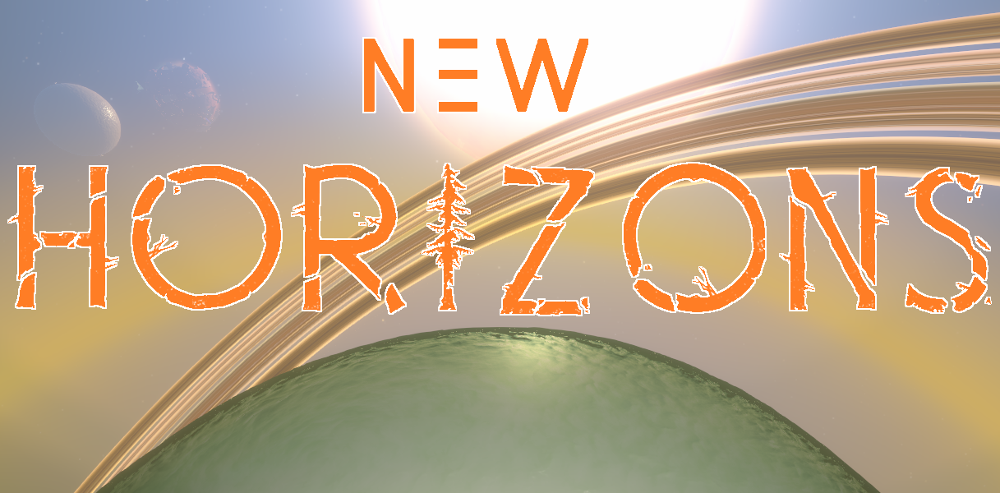

A planet creator for Outer Wilds.

Planets are created using a JSON file format structure, and placed in the `planets` folder.

Moon support is coming soon!

<!-- TOC -->

- [Creating a planet file](#creating-a-planet-file-)
- [Using Marshmallow from other mods](#using-marshmallow-from-other-mods-)
- [Submit bugs / Chat about life](#submit-bugs--chat-about-life-)

<!-- /TOC -->

## Creating a planet file :
This list will update as more options are added. Structure JSON file like so :
```
{
    	"name" : "Test Planet",
      "position" : {
		      "x" : 0,
		      "y" : 0,
		      "z" : 5000
	    },
      "orbitAngle" : 0,
      "primaryBody" : "SUN",
      "hasFog" : true,
      "fogTint" : {
		      "r" : 255,
		      "g" : 100,
		      "b" : 0,
		      "a" : 128
	    },
      "fogDensity" : 0.5
}
```
Everything in "Required" is always needed, and so is every tabbed line in an option.
### Required :
- name - The name of the planet.
- position - The Vector3 positon of the planet in world space.
- orbitAngle - The angle of the orbit.
- primaryBody - The AstroObject ID of the body this planet orbits.
- isMoon - Is the body a moon or not a moon (a planet)?

### Optional :
- hasGround - Set to "true" if you want to have a sphere as a ground.
  - groundSize - The size of the ground sphere.
- hasClouds - Set to "true" if you want Giant's Deep-type clouds.
  - topCloudSize - The size of the outer sphere of the clouds.
  - bottomCloudSize - The size of the bumpy clouds underneath the top. *(Check that the bottom clouds are not poking through the top!)*
  - topCloudTint - The color of the top clouds.
  - bottomCloudTint - The color of the bottom clouds.
- hasWater - Set to "true" if you want water.
  - waterSize - Size of the water sphere.
- hasRain - Set to "true" if you want it to be raining.
- hasGravity - Set to "true" if you want gravity.
  - surfaceAcceleration - Strength of gravity.
- hasMapMarker - Set to "true" if you want the planet name on the map.
- hasFog - Set to "true" if you want fog.
  - fogTint - The color of the fog.
  - fogDensity - The thickness of the fog. \[0-1]
  
## Using Marshmallow from other mods :
Marshmallow uses the fancy API system provided by OWML to allow other mods to communicate with it. As this system is currently still being worked on (by me :P), the way the Marshmallow API is used is slightly more annoying than when the system will be finished.

To use the API, first define this interface in your mod.
```
public interface IMarshmallow
{
    void Create(Dictionary<string, object> config);
    
    GameObject GetPlanet(string name);
}
```
Then, you need to find the Marshmallow API. This can be done using the interaction helpers of OWML.
```
var marshmallowApi = ModHelper.Interaction.GetApi<IMarshmallow>("misternebula.Marshmallow");
```
**Make sure that Marshmallow is defined as a dependency! This will prevent any load-order issues from occuring.**
Next, we need to generate the dictionary of config options. To save time, you can copy this definition and just change the values.
```
var configDict = new Dictionary<string, object>
                {
                    { "name", "Test Planet" },
                    { "position", new Vector3(0, 0, 3000) },
                    { "orbitAngle", 0 },
                    { "primaryBody", "SUN" },
                    { "hasSpawnPoint", true },
                    { "hasGround", true },
                    { "groundSize", 400f },
                    { "hasClouds", true },
                    { "topCloudSize", 650f },
                    { "bottomCloudSize", 600f },
                    { "topCloudTint", new Color32(255, 0, 0, 128) },
                    { "bottomCloudTint", new Color32(255, 0, 0, 128) },
                    { "hasWater", true },
                    { "waterSize", 401f },
                    { "hasRain", true },
                    { "hasGravity", true },
                    { "surfaceAcceleration", 12f },
                    { "hasMapMarker", true },
                    { "hasFog", true },
                    { "fogTint", new Color32(255, 0, 0, 128) },
                    { "fogDensity", 0.5f },
                };
```
Then, you just call the `Create` method in the API!
```
marshmallowApi.Create(configDict);
```
## Submit bugs / Chat about life :
Did you know we have a nice [Outer Wilds discord](https://discord.gg/Sftcc9Z)? Drop by to submit bugs, ask questions, and chat about whatever.
Join us modding folk in the `#modding` channel!

## Credits :
Written by Mister_Nebula

With help from :
- TAImatem
- AmazingAlek
- Raicuparta
- and the Outer Wilds discord server.
